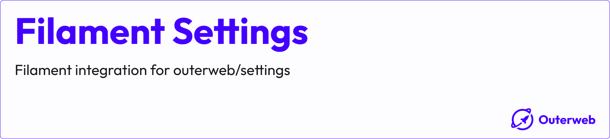

# Filament Settings

[](https://packagist.org/packages/outerweb/filament-settings)
[](https://github.com/outer-web/filament-settings/actions?query=workflow%3Arun-tests+branch%3Amain)
[](https://github.com/outer-web/filament-settings/actions?query=workflow%3A"Fix+PHP+code+style+issues"+branch%3Amain)
[](https://packagist.org/packages/outerweb/filament-settings)

This Filament plugin provides an integration for the [outerweb/settings](https://github.com/outer-web/settings) package.

## Table of Contents

-   [Installation](#installation)
-   [Usage](#usage)
-   [Changelog](#changelog)
-   [License](#license)

## Installation

You can install the package via composer:

```bash
composer require outerweb/filament-settings
```

Follow the installation instructions for the [outerweb/settings](https://github.com/outer-web/settings#installation) package.

Add the plugin to your panel:

```php
use Outerweb\FilamentSettings\SettingsPlugin;

public function panel(Panel $panel): Panel
{
    return $panel
        // ...
        ->plugins([
            // ...
            SettingsPlugin::make()
                ->pages([
                    // Add your settings pages here
                ]),
        ]);
}
```

## Usage

### Create a Page

Create a settings page by extending `Outerweb\FilamentSettings\Pages\Settings`:

```php
namespace App\Filament\Pages;

use Outerweb\FilamentSettings\Pages\Settings;

class MySettings extends Settings
{
    public function form(Schema $schema): Schema
    {
        return $schema
            ->components([
                Tabs::make()
                    ->columnSpanFull()
                    ->tabs([
                        Tab::make('General')
                            ->schema([
                                TextInput::make('general.brand_name')
                                    ->required(),
                            ]),
                        Tab::make('Seo')
                            ->schema([
                                TextInput::make('seo.title')
                                    ->required(),
                                TextInput::make('seo.description')
                                    ->required(),
                            ]),
                    ]),
            ]);
    }
}
```

### Creating multiple pages

You can create as many settings pages as you want.

```php
use Outerweb\FilamentSettings\SettingsPlugin;

public function panel(Panel $panel): Panel
{
    return $panel
        // ...
        ->plugins([
            // ...
            SettingsPlugin::make()
                ->pages([
                    \App\Filament\Pages\GeneralSettings::class,
                    \App\Filament\Pages\SeoSettings::class,
                    \App\Filament\Pages\OtherSettings::class,
                ]),
        ]);
}
```

Each page just needs to extend `Outerweb\FilamentSettings\Pages\Settings`. You can override the all properties like the `icon`, `navigationGroup`... just like a normal Filament page.

### Mutating settings data

You can mutate the settings before filling the form and before saving them to the database by defining the `mutateFormDataBeforeFill` and `mutateFormDataBeforeSave` methods.

For example, if you want to store all settings under a specific tenant key:

```php
    public function mutateFormDataBeforeFill(array $data): array
    {
        return collect($data)->get($this->getTenantKey(), []);
    }

    public function mutateFormDataBeforeSave(array $data): array
    {
        return collect($data)->mapWithKeys(function ($item, $key) {
            return ["{$this->getTenantKey()}.{$key}" => $item];
        })->toArray();
    }

    /**
     * A custom function for this example
     */
    private function getTenantKey(): string
    {
        return 'tenant'; // Your logic to determine the tenant
    }
```

## Changelog

Please see [CHANGELOG](CHANGELOG.md) for more information on what has changed recently.

## License

The MIT License (MIT). Please see [License File](LICENSE.md) for more information.
